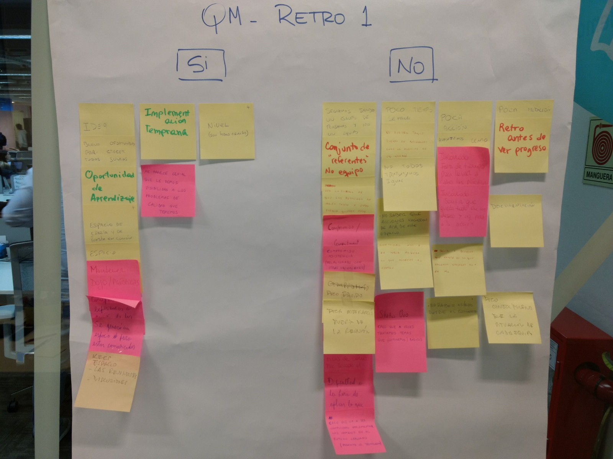
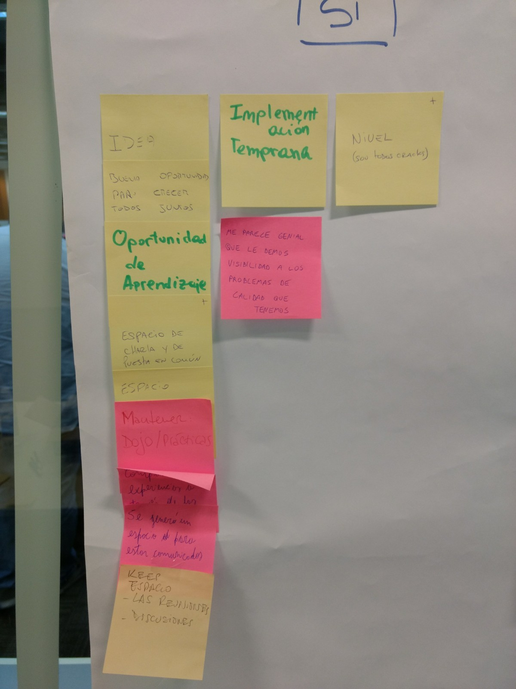
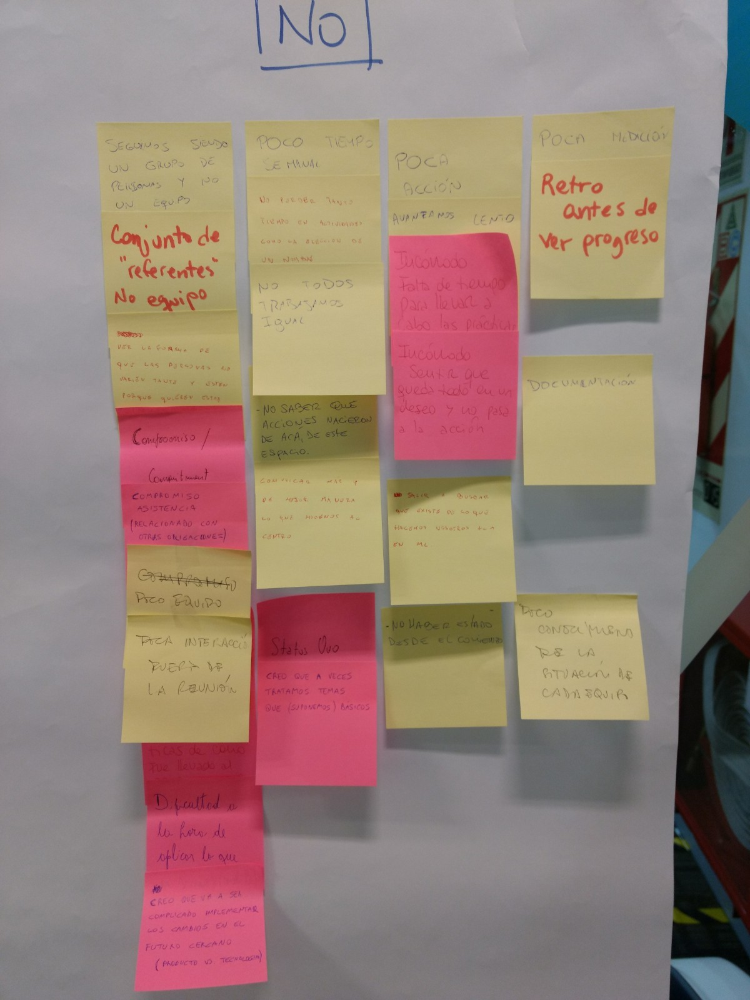

# Meeting minute - 2018-04-18

**¿Por qué creemos que estamos creando el equipo?**
- Mejorar los equipos (técnicamente/calidad)
- Aprovechar las oportunidades
- Alinearlos a nivel centro
- Fijar principios
- Unificar criterios / patrones
- Estandarizar
- Definir calidad

## Retrospective

JuanMa Z (Remoto)

- **SI**
  - Intención del espacio
  - Documentación
- **NO**
  - Lento
  - Nada en concreto

## Timeline
- [x] 0
- [x] QM
- [x] Criterios 1,2,3
- [x] Testing
- [ ] Capacitación test
- [ ] Batalla TDD (Deuda) vs MeLi (Collection)
- [ ] TBD (To Be Defined)
- [ ] Implementar TDD
- [ ] META ==> Vision

## Tareas

A nivel general vimos que necesitamos:

- Poner a prueba si TDD es el camino que nos sirve
- Relevar necesidades de cada equipo
- Relevar qué puede aportar cada equipo
- Investigar aplicación de TDD en Frontend / Mobile Nativo
- Ser más visibles como equipo

Para atacar estas tareas nos dividimos en grupos:
 
- **Visibilidad**
  - Nahuel R., Jero V.
  - Tareas comprometidas
    - Dar visibilidad a Lideres y Manager del centro
- **Batalla / Capacitación**
  - Eze C., Alvin, Diego S., Jero V.
  - Tareas comprometidas
    - Alinear batalla (qué y cómo va a estar sucediendo)
    - Enrolar a los equipos a que tomen el desafío
    - Definir el qué y el cómo de la capacitación
- **Relevamientp + Quien?**
  - Alex I., Joaco, Tincho D., JuanMa Z.
  - Tareas comprometidas
    - Lista de temas y preguntas guía para relevar conocimientos
    - Relevar necesidades
- **Testing Web / Mobile**
  - Mauricio B., Eze P., Pablo G.
  - Tareas comprometidas
    - Investigar metodologías utilizadas/existentes dentro y fuera de MeLi para realizar TDD/tests en Frontend/Mobile
